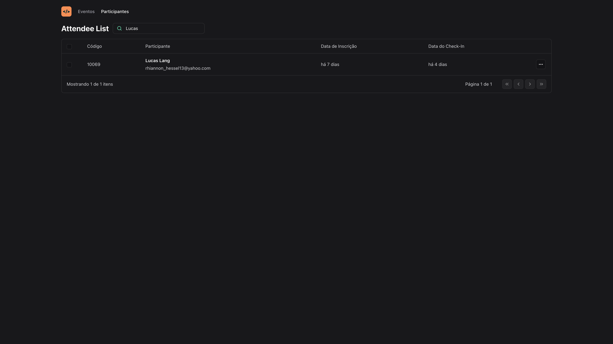

<h1 align="center">NLW Unite</h1>

<p align="center">Development of a front-end application in ReactJS, applying concepts of Properties, States, and Components, typing with Typescript, tooling with Vite, responsive interface with TailwindCSS, consumption of Node.js API, and utilization of URL states.</p>

<br />

## Screenshots

#### Attendee


#### Search



<br />

## Running the Application

<a href="https://nlw-unite.netlify.app" target="_blank">Access the Project's website by clicking here.</a>

```
https://nlw-unite.netlify.app
```

<br />
<i>Follow the steps to run the Project on your local machine.</i>
<br />

#### Requirements

- [Node](https://nodejs.org/en/)
- [Yarn](https://classic.yarnpkg.com/lang/en/) or [Npm](https://www.npmjs.com/)

#### Clone the repository and navigate to the folder

```
$ git clone https://github.com/MatheusPalmieri/nlw-unite && cd nlw-unite
```

#### Installing necessary dependencies

```
$ npm install or yarn
```

#### Run local project

```
$ npm run dev or yarn dev
```

<i>Open the browser on the page "http://localhost:5173" to view.</i>

<br />

## Technologies

<p>The following tools were used in the project:</p>

**Frontend**: React, TypeScript and Tailwind.

<br />

## License

This project is licensed under the [MIT License](LICENSE).

<br />

## Author

Created by <b>`Matheus Palmieri`</b>👨‍💻

<br />

<p align=\"center\">📜 NLW Unite 🚀</p>
